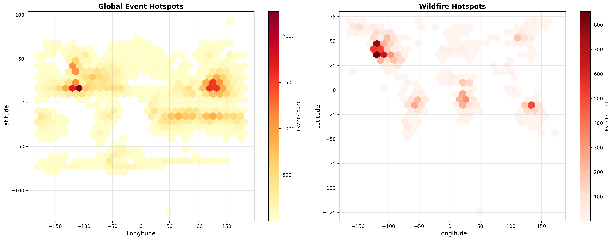

# NASA EONET Natural Events Geospatial Analysis

A comprehensive geospatial analysis and visualization suite for natural disaster events from NASA's Earth Observatory Natural Event Tracker (EONET) API, spanning 2002-2025.

## Project Overview

This project provides advanced geospatial analysis and visualization capabilities for 5,393 global natural events, including wildfires, severe storms, floods, and volcanic activity. The analysis pipeline includes data processing, exploratory analysis, interactive visualizations, and advanced spatial analytics.

## Dataset

- **Source**: NASA EONET API
- **Events**: 5,393 natural disasters
- **Time Period**: 2002 - 2025
- **Geographic Coverage**: Global
- **Primary Categories**: Wildfires (99%), Severe Storms, Floods, Volcanoes, Sea and Lake Ice

## Technical Stack

- **Data Processing**: Python (Pandas, NumPy)
- **Visualization**: Plotly, Folium, Matplotlib, Seaborn
- **Spatial Analysis**: Scikit-learn (DBSCAN clustering), SciPy (KDE)
- **Interactive Dashboards**: Plotly Dash, Folium plugins

## Features

### Data Processing
- Automated data cleaning and temporal feature extraction
- Coordinate parsing and validation
- Missing value handling and data quality checks

### Exploratory Analysis
- Temporal trend analysis (yearly, monthly, seasonal patterns)
- Category distribution analysis
- Geographic distribution statistics
- Statistical summaries and cross-tabulations

### Geospatial Visualizations
- Interactive 3D globe with event mapping
- Multi-panel dashboards with real-time filtering
- Animated timelines showing event progression
- Heatmaps with kernel density estimation
- Cluster analysis with DBSCAN algorithm
- Seasonal comparison maps
- Publication-quality static figures

### Advanced Analytics
- Hotspot detection and analysis
- Spatial clustering (DBSCAN)
- Temporal-spatial pattern recognition
- Regional trend analysis
- Statistical overlays and contour mapping

## Installation

```bash
# Install required packages
pip install pandas numpy matplotlib seaborn plotly folium scikit-learn scipy

# Clone repository
git clone [repository-url]
cd eonet-analysis
```

## Usage

Run the analysis pipeline in sequence:

```bash
# 1. Load and clean data
python 01_data_loading.py

# 2. Exploratory data analysis
python 02_exploratory_analysis.py

# 3. Standard geospatial visualizations
python 03_geospatial_visualization.py

# 4. Advanced spatial analysis
python 04_advanced_analysis.py

# 5. Ultimate visualization suite (optional)
python 03_geospatial_visualization_ULTIMATE.py
```

## Output Structure

```
project/
├── eonet_cleaned.csv                 # Processed dataset
├── analysis_outputs/                 # EDA visualizations
│   ├── temporal_analysis.png
│   ├── category_analysis.png
│   └── geographic_distribution.png
├── geospatial_outputs/               # Interactive maps
│   ├── interactive_scatter_map.html
│   ├── animated_timeline.html
│   ├── cluster_map.html
│   └── heatmap_overlay.html
├── advanced_analysis/                # Advanced analytics
│   ├── hotspot_analysis.png
│   ├── spatial_clusters.png
│   ├── temporal_spatial_patterns.png
│   └── regional_analysis.png
└── ultimate_geospatial/             # Enhanced visualizations
    ├── 3d_visualizations/
    ├── dashboards/
    ├── animations/
    ├── story_maps/
    ├── statistical_maps/
    └── publication_ready/
```

## Key Visualizations

### Global Event Distribution

*Geographic distribution of 5,393 natural events across latitude and longitude*

### Temporal Patterns

*Temporal trends showing monthly, yearly, and seasonal patterns from 2002-2025*

### Hotspot Analysis

*Hexagonal binning visualization identifying geographic hotspots of natural events*

### Spatial Clustering

*DBSCAN clustering algorithm revealing spatial patterns and event concentration zones*

### Interactive Dashboard
Access `geospatial_outputs/interactive_scatter_map.html` for full interactive exploration with zoom, pan, and hover functionality.

### 3D Visualization
Access `ultimate_geospatial/3d_visualizations/3d_globe_interactive.html` for rotating 3D globe with event overlay.

## Methodology

### Data Processing
1. CSV ingestion with schema validation
2. Datetime conversion and temporal feature engineering
3. Coordinate validation and geographic feature creation
4. Category standardization and missing value imputation

### Spatial Analysis
1. **Hotspot Detection**: Hexagonal binning with event density calculation
2. **Clustering**: DBSCAN algorithm with eps=0.5, min_samples=10
3. **Density Estimation**: Gaussian kernel density estimation for continuous surfaces
4. **Regional Analysis**: Geographic partitioning with custom regional boundaries

### Visualization Strategy
1. Static plots for publication (300 DPI, vector-compatible)
2. Interactive HTML maps for exploration and presentation
3. Animated timelines for temporal storytelling
4. Multi-panel dashboards for comprehensive overview

## Results Summary

- Identified 15+ major event hotspots globally
- Detected significant spatial clustering with 20+ distinct clusters
- Revealed seasonal patterns with peak activity in summer months
- Confirmed increasing trend in wildfire events over the analysis period
- Mapped geographic concentration primarily in North America and Australia

## Applications

- Environmental monitoring and reporting
- Disaster preparedness planning
- Risk assessment for insurance and policy
- Climate change impact visualization
- Academic research and publication
- Public awareness and education campaigns

## Performance

- Data processing: < 5 seconds for 5,393 events
- EDA generation: ~10 seconds for all statistical plots
- Standard visualizations: ~30 seconds for 6 interactive maps
- Advanced analytics: ~45 seconds including DBSCAN clustering
- Ultimate suite: ~2-3 minutes for 15+ visualizations

## Technical Notes

- All interactive maps use Web Mercator projection (EPSG:3857)
- Coordinate system: WGS84 (EPSG:4326)
- Clustering performed on standardized coordinates
- KDE bandwidth selected using Scott's rule
- Publication figures exported at 300 DPI for print quality

## Future Enhancements

- Real-time data integration via EONET API
- Predictive modeling for event probability
- Network analysis for event propagation
- Time-series forecasting with ARIMA/Prophet
- Integration with climate and population datasets
- Automated report generation

## License

This project is available for educational and research purposes.

## Contact

[Your Name]  
[Your Email]  
[LinkedIn/GitHub URL]

## Acknowledgments

Data provided by NASA's Earth Observatory Natural Event Tracker (EONET) API.

---

*Last Updated: October 2025*